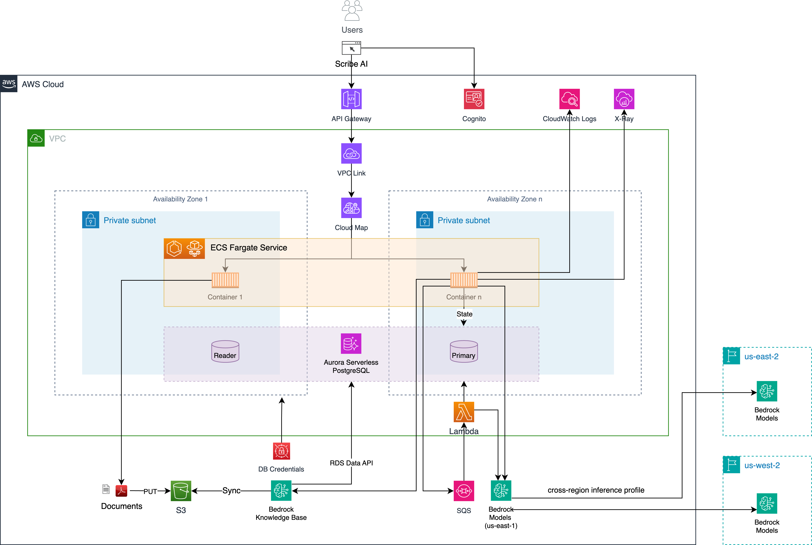

# Scribe AI

A knowledge capture assistant for preserving critical expertise and enabling AI innovation.

## What?

Scribe AI transforms natural conversations with experts into structured, AI-ready documentation. This helps organizations preserve vital institutional knowledge while supporting their digital transformation and AI initiatives.

## Key Capabilities

- Knowledge capture interview workflow
- AI-driven interviews
- Natural language conversation capture
- Experimental interview talk mode [*](#notes-on-experiemental-talk-mode)
- Human in the loop review
- Knowledge base with semantic search
- Built in AI chatbot
- Rich document generation

## Key Technical Capabilities

- Deployable in under 15 minutes using IaC (instructions below)
- Cognito for authentication and authorization
- Auto-scaling architecture (see docs below)
- OpenTelemetry tracing support using AWS X-Ray
- Nova Sonic integration for voice interviews

## Architecture



## Deployment

Follow these 5 steps to deploy this solution to your AWS account:

1. Setup/Install prerequisites
2. Prepare command-line shell environment
3. Deploy cloud infrastructure
4. Deploy application code
5. Navigate to the app endpoint

### 1. Setup/Install prerequisites

- [Enable the Bedrock models you'll use for KB ingestion and app generation](https://docs.aws.amazon.com/bedrock/latest/userguide/model-access.html)
- IAM permissions to deploy AWS resources. See the [IAM policy](./policy.json) for the minimum set of permissions required to perform the deployment.
- Ensure access to a POSIX-compatible command-line shell that can run bash-like commands. Tested on MacOS but should work on Linux or Windows via WSL (Windows Subsystem for Linux). Note: Instructions will not work on Windows command-line or PowerShell.
- [AWS CLI](https://docs.aws.amazon.com/cli/latest/userguide/getting-started-install.html)
- [Terraform](https://developer.hashicorp.com/terraform/tutorials/aws-get-started/install-cli)
- [Docker Desktop](https://www.docker.com/products/docker-desktop/)
- [jq CLI](https://jqlang.github.io/jq/download/)

### 2. Prepare command-line shell environment

Export required environment variables.

```sh
export AWS_REGION=$(aws configure get region || echo "us-east-1")
export ACCOUNT=$(aws sts get-caller-identity --query Account --output text)
export BUCKET=tf-state-${ACCOUNT}
```

Choose a unique name for your deployment. Note that this is important because every AWS resource will have this as part of its name.

```sh
export APP_NAME="scribe"
```

Before we get into deployment, let's review the project's directory structure.

```
.
|____web          # Python web application
| |____shared     # Symbolic link to ../shared code
|____shared       # Python code shared between web and events
|____iac          # Terraform Infrastructure As Code (IAC)
|____events       # Python code for running async events
| |____shared     # Symbolic link to ../shared code
|____voice        # TypeScript Lambda for voice interview processing
```

- The `iac` directory contains the Terraform Infrastructure as Code (IaC) to deploy the full app stack
- The `web` directory contains the Python code for the web application
- The `events` directory contains the Python code for handling asynchronous events
- The `voice` directory contains the TypeScript Lambda function for voice interview processing with Nova Sonic
- The `shared` directory contains Python code that is shared between `web` and `events`. This code is symlinked into both the `web` and `events` directories to make it easier to reference. This means that when you change code in `./shared` it's immediately reflected in both `./web/shared` and `./events/shared`.

### 3. Deploy cloud infrastructure

Optionally, create an S3 bucket to store Terraform state (this is recommended since the initial DB password will be stored in the state). If you already have an S3 bucket, you can update the `BUCKET` variable with the name of your bucket (e.g., `export BUCKET=my-s3-bucket`).

```sh
aws s3 mb s3://${BUCKET}
```

Set Terraform input parameters, like app `name` and `tags` in `terraform.tfvars`.

```sh
cd iac
cat << EOF > terraform.tfvars
name = "${APP_NAME}"
tags = {
  app = "${APP_NAME}"
}
EOF
```

Run the following script to generate a random key and store it in AWS Secrets Manager. It's important that the secret name exactly matches the Terraform variable `session_key_secret_name` which by default is `${APP_NAME}-session-key`. Note that this key will be used to encrypt session state.

```sh
RANDOM_VALUE=$(cat /dev/urandom | LC_ALL=C tr -dc '0-9' | fold -w 24 | head -n 1)
SECRET_NAME="${APP_NAME}-session-key"
aws secretsmanager create-secret --name "${SECRET_NAME}" \
  --description "Session encryption key for ${APP_NAME}" \
  --secret-string ${RANDOM_VALUE}
```

Deploy the app stack using the Terraform CLI (Note the use of the `APP_NAME` in the key. This is important if you wish to deploy multiple Scribe environments in the same AWS account).

Note: Before deploying, you should consider changing the [prompts](./shared/prompts/) to match your specific requirements. You can also change these later in the AWS Bedrock console.

```sh
terraform init -backend-config="bucket=${BUCKET}" -backend-config="key=${APP_NAME}.tfstate"
terraform apply
```

### 4. Deploy application code

#### Deploy Web Application

Now that the infrastructure has been deployed, you can build the web app container and deploy it on top of the infrastructure.

If you changed the app name from `scribe` to something else, you'll need to pass that to the make command using the `app` parameter (or change it at the top of `Makefile`).

The first time you deploy you can run the following to build the base image and app image together.

```sh
cd ../web
make baseimage && make deploy
```

After the initial deployment, you can iterate on code changes faster by only rebuilding the code layers and re-deploying.

```sh
cd web
make deploy
# OR
make deploy app=${APP_NAME}
```

#### Deploy Events Lambda Function

This Lambda function that runs async events is automatically deployed during the `terraform apply` process as part of the Infrastructure as Code (IaC). The project architecture maintains a clear separation between infrastructure and application code. This design decision allows for different deployment frequencies: infrastructure changes less frequently, while application code can be updated more often.

This separation enables a streamlined CI process for application code updates (implementation of which is left to the reader), without requiring frequent infrastructure redeployments. The result is a more efficient and less risky development workflow that accommodates the different change cadences of infrastructure and application components.

*This step is only required if you make changes to the Lambda code. To deploy changes to the Lambda function code (which uses containers for packaging), you can run the following:

```sh
cd events
make deploy app=${APP_NAME}-events
```

#### Deploy Voice Processor Lambda Function

This Lambda function brokers connectivity between Nova Sonic and AppSync Events. Similar to the events lambda above, it is automatically deployed during the `terraform apply` process as part of the Infrastructure as Code (IaC).

*This step is only required if you make changes to the Lambda code. To deploy changes to the Lambda function code (which uses containers for packaging), you can run the following:

```sh
cd voice
make deploy app=${APP_NAME}-voice
```

### 5. Navigate to the app endpoint

Run the following command to access the deployed web application endpoint:

```sh
cd ../iac
open $(terraform output -raw endpoint)
```

---

### Adding Users

Before you'll be able to sign in, you need to first create some users. To do this, go to [Cognito in the AWS console](https://docs.aws.amazon.com/cognito/latest/developerguide/managing-users.html) and create users there. Be sure to add users to the `admin` group if you want them to be able to manage knowledge scopes, topics, and interview assignments.

## Scaling

This architecture can be scaled using the following levers:

1. ECS horizontal scaling
2. ECS vertical scaling
3. Aurora serverless scaling
4. Bedrock scaling

### ECS horizontal scaling

The preferred method of scaling is horizontal autoscaling. Autoscaling is enabled by default and set to scale from 1 to 10 replicas based on an average service CPU and memory utilization of 75%. See the [Terraform module autoscaling input parameters](https://registry.terraform.io/modules/terraform-aws-modules/ecs/aws/latest/submodules/service?tab=inputs) to fine tune this.

### ECS vertical scaling

The size of the individual fargate tasks can be scaled up using the [cpu and memory parameters](./iac/ecs.tf).

### Aurora serverless scaling

Autoscaling is enabled by default set to a default min capacity of 0.5 to 2 ACUs. See the [Terraform module autoscaling example](https://registry.terraform.io/modules/terraform-aws-modules/rds-aurora/aws/latest/examples/autoscaling) to fine tune this.

### Bedrock scaling

Bedrock cross-region model inference is recommended for increasing throughput using [inference profiles](https://docs.aws.amazon.com/bedrock/latest/userguide/inference-profiles.html).

## API Endpoints

The application provides several REST API endpoints for interacting with the chatbot and knowledge base:

### Chat Endpoints

- **POST /api/ask**
  - Creates a new conversation and returns an answer to a question
  - Request body: `{"question": "Your question here"}`
  - Response: `{"conversationId": "uuid", "answer": "Answer text"}`

- **POST /api/ask/:id**
  - Adds a question to an existing conversation
  - Request body: `{"question": "Your follow-up question"}`
  - Response: `{"conversationId": "uuid", "answer": "Answer text"}`

### Knowledge Base Search

- **POST /api/search**
  - Directly searches the Bedrock Knowledge Base with scope filtering
  - Request body:
    ```json
    {
      "query": "Your search query",
      "scope_id": "uuid-of-scope",
      "result_count": 5  // optional, defaults to 5
    }
    ```
  - Response:
    ```json
    {
      "query": "Your search query",
      "scope_name": "Scope Name",
      "results": [
        {
          "content": "Document content...",
          "source": "s3://bucket-name/path/to/document.pdf",
          "score": 0.95
        }
      ]
    }
    ```

### Scope Management

- **GET /api/scopes**
  - Returns all available knowledge scopes
  - Response:
    ```json
    {
      "scopes": [
        {
          "id": "uuid",
          "name": "Scope Name",
          "description": "Scope description",
          "created": "2025-04-17T15:36:54.661181+00:00"
        }
      ]
    }
    ```

### Topic Management

- **GET /api/topics**
  - Returns all available topics, optionally filtered by scope
  - Query parameters:
    - `scope_id`: Optional UUID to filter topics by scope
  - Response:
    ```json
    {
      "topics": [
        {
          "id": "uuid",
          "name": "Topic Name",
          "description": "Topic description",
          "areas": ["area1", "area2"],
          "scope_id": "uuid-of-scope",
          "scope_name": "Scope Name",
          "created": "2025-04-17T15:36:54.661181+00:00"
        }
      ]
    }
    ```

### Conversation Management

- **GET /api/conversations**
  - Returns the 10 most recent conversations

- **GET /api/conversations/users/:user_id**
  - Returns the 10 most recent conversations for a specific user

- **GET /api/conversations/:id**
  - Returns a specific conversation by ID

- **GET /api/interviews**
  - Returns the 10 most recent interviews

## OpenTelemetry

This accelerator ships with OpenTelemetry auto instrumented code for flask, postgres, and boto3 via the [aws-opentelemetry-distro](https://pypi.org/project/opentelemetry-distro/) library. It will create traces that are available in [AWS X-Ray](https://aws.amazon.com/xray/). These traces can be useful for understanding how the AI orchestrator is running in production. You can see how an HTTP request is broken down in terms of how much time is spent on various external calls such as calls to the database and calls to LLMs.


### Disabling tracing

If you'd like to disable the tracing to AWS X-Ray, you can remove the otel sidecar container and dependencies from the ECS task definition as shown below.

```
      dependsOn = [
        {
          containerName = "otel"
          condition     = "HEALTHY"
        }
      ]
    },
    otel = {
      image   = "public.ecr.aws/aws-observability/aws-otel-collector:v0.41.2"
      command = ["--config=/etc/ecs/ecs-default-config.yaml"]
      healthCheck = {
        command     = ["/healthcheck"]
        interval    = 5
        timeout     = 6
        retries     = 5
        startPeriod = 1
      }
    },
```

## Development

```
 Choose a make command to run

  init           run this once to initialize a new python project
  install        install project dependencies
  start          run local project
  baseimage      build base image
  deploy         build and deploy container
  up             run the app locally using docker compose
  down           stop the app
  start-docker   run local project using docker compose
```

### Running locally

Run the setup scripts (for both `web` and `events`):

```sh
./local-setup.sh

Extracting configuration from Terraform outputs...
Local environment setup complete!
----------------------------------------
Configuration written to web/.env file
----------------------------------------
To run the application locally:
1. Make sure Docker Desktop is running
2. Run 'cd web && make baseimage' (if you haven't already)
3. Run 'cd web && make up'
----------------------------------------
```

This produces `.env` files with required configuration. After you do this, you can run the app locally in docker to iterate on code changes before deploying to AWS. When running the app locally it talks to a local postgres database and uses various remote AWS APIs.

Ensure that you have valid AWS credentials.

If you didn't execute the steps above to deploy to AWS, you'll need to first build the base container image.

```sh
cd web
make baseimage
```

Running the `make up` command will start a postgres database instance and a web container.

```sh
cd web
make up
```
```sh
cd events
make up
```

If you make code changes, you can rebuild and restart the container by hitting Ctrl-C and re-running `make up`.

To stop the environment simply run:

```sh
make down
```

### Apply remote database changes

To make database changes to Aurora, you can use the following:

```sh
cd iac
export CLUSTER_ARN=$(terraform output -raw db_cluster_arn)
export ADMIN=$(terraform output -raw db_creds_secret_arn)
export DB_NAME=postgres
./db-migrate.sh
```

### Notes on Experiemental Talk Mode

This is an experimental feature that enables human-like voice-driven interviews using cutting-edge AI speech-to-speech foundation models on Amazon Bedrock.  The current version has two main limitations:

1. The Amazon Nova Sonic model we're currently using has an 8-minute hard time limit on a session.

2. When users give long verbal responses with extensive pauses between thoughts, the model sometimes interrupts and moves on to new topics, which can disrupt the flow of the interview.

We've conducted most of our testing using the Chrome browser which seems to work best. Your mileage may vary using other browsers.
